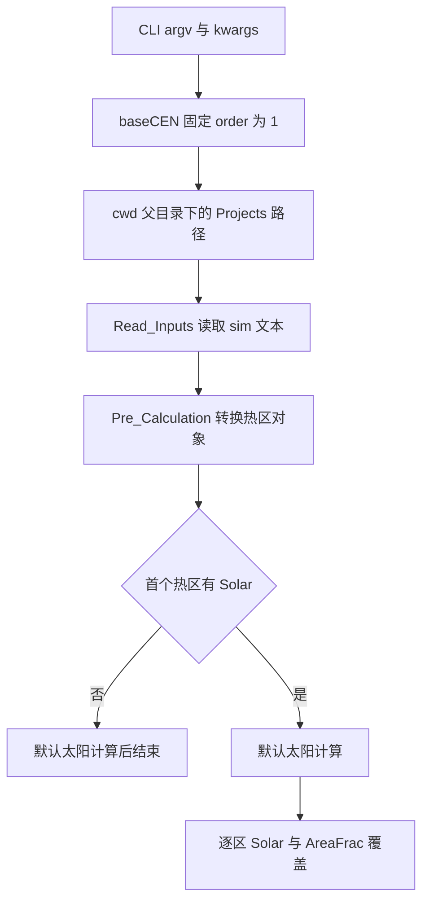

# RCBldEng v1.3.0 Linux 静态逆向报告

分析日期：2026-09-07。用户授权对其提供的引擎进行源码恢复和协议确认；目标为正式 `RCBldEng-v1.3.0.zip`，不是上游文件树中另一份 EXE。完整范围见 [scope.md](../scope.md)，过程见 [timeline.md](../timeline.md)。

## 结论与证据等级

已在 Linux 上解开 PyArmor 保护层，并取得 5 个业务模块、196 个代码对象的可读反汇编。正式 CLI 的参数位置、默认值和项目路径已有直接静态证据；`.sim` 解析和外部太阳覆盖分支也已定位。自动反编译没有恢复可运行源码，Windows 引擎及数值行为仍未执行验证。重构可以据此收紧适配器候选，但不能把恢复文本直接作为替代引擎。

本报告的 `validated` 仅表示已核对所列反汇编指令，不表示运行或物理正确性验收。由类型传播预测的异常使用 `candidate`。方法和复现命令见 [README](../README.md)；所有生成证据的大小和 SHA-256 见 [manifest](../manifest.json)。

| 对象 | SHA-256 |
|---|---|
| 用户 ZIP | `824b0cf2f84cb26634d3c920dd38aa97ad041984c6bf21dfc55f0e76bcbf0355` |
| ZIP 内 EXE | `944939cbf14bad46f262543291758bb95527b6e70fa5c701c39d26b8560a4f43` |
| PyArmor PYD | `20cad40330c4a7102d3bb34e38197f60f38b7195d83d2a393d1ab0728b141551` |

## 恢复范围

| 模块 | 代码对象数 | 反汇编字节数 | 自动源码状态 |
|---|---:|---:|---|
| [RCBldEng](../disassembly/RCBldEng.das) | 5 | 31,587 | 63 字节，只有注释，零函数 |
| [lib](../disassembly/lib.das) | 119 | 1,015,987 | 第 45 行语法错误 |
| [weather](../disassembly/weather.das) | 19 | 189,883 | 第 73 行语法错误 |
| [simulation](../disassembly/simulation.das) | 45 | 698,868 | 第 120 行语法错误 |
| [comfort](../disassembly/comfort.das) | 8 | 120,351 | 第 234 行语法错误 |

对象数包括模块、类、方法和推导式，不能称为 196 个完整业务函数。PyArmor 占位符、混淆变量名和工具重写的 NOP 仍然存在。以下位置采用模块、函数及反汇编字节偏移；文件行号只是生成产物的定位辅助，不是遗失源码的行号。

### E 证据索引

| Evidence | 来源与可复现内容 |
|---|---|
| [E-extraction](../evidence/E-extraction.md) | 固定 ZIP、CRC、入口及 PYD 指纹、5 个保护入口 |
| [E-engine-imports](../evidence/E-engine-imports.md) / [E-runtime-imports](../evidence/E-runtime-imports.md) | `rabin2` 完整 PE 节、导入和导出 JSON |
| [E-RCBldEng](../evidence/E-RCBldEng.md) / [E-lib](../evidence/E-lib.md) | CLI、文件解析和预处理反汇编 |
| [E-simulation](../evidence/E-simulation.md) / [E-weather](../evidence/E-weather.md) / [E-comfort](../evidence/E-comfort.md) | 计算、天气和舒适度反汇编；后两者本轮未作完整行为审查 |
| [E-validation](../evidence/E-validation.md) / [E-decompiler-log](../evidence/E-decompiler-log.md) | 重复恢复哈希、草稿语法失败、脱敏工具日志 |

PE 信息先于函数分析取得。PYD 导出 `PyInit_pyarmor_runtime`，导入 `python39.dll` 的 marshal、代码对象构造和求值函数。导入表分别提供 Python 加载、系统/文件、加密相关线索；仅出现某个导入不证明该路径被执行。本次未从网络相关符号推断目标联网行为。

静态工具从运行时常量派生密钥，解开模块序列化数据，再处理函数内层保护和 Python 3.9 指令。外层 5 个模块均得到代码对象结构，随后完整生成反汇编。[GDATA 的原始研究](https://cyber.wtf/2025/02/12/unpacking-pyarmor-v8-scripts/)用于方法交叉参考；本次恢复结果来自固定版本的 [1shot 工具](https://github.com/Lil-House/Pyarmor-Static-Unpack-1shot/tree/e64b5a288a1161862196e473fe40ea691205b58e)，未进行第二套解析器验证。

## 核心发现

### F-cli

- title: 正式入口固定一阶并以 cwd 父目录定位项目
- severity: n/a_re
- category: reverse_algo
- evidence_ids: E-RCBldEng, E-extraction, E-simulation
- confidence: high
- location: RCBldEng.main @22–50；baseCEN @32–124、126–230、266–284；模块入口 @112–162
- status: validated

`main` 直接读取 `argv[1]`、`argv[2]`、`argv[4]`，依次作为建筑名、起始星期和运行名；该函数没有校验 `argv[3]` 是 `-sim`。第 5 项之后的参数仅保留包含 `=` 的字符串，按第一个 `=` 分割并构造字典。正式调用仍应遵守 README 的 `-sim` 写法，不能把缺少校验当作稳定公共 API。

`baseCEN` 构造 `abspath(join(getcwd(), pardir)) + '\\'`，输入为其下 `Projects\<building>\<run>\<building>_<run>.sim`。不是依据 EXE 的实际文件路径定位。先读取输入，再检查并创建输出目录；创建目录不能弥补缺失输入。

| 选项 | 入口默认值与传递方式 |
|---|---|
| `order` | 固定整数 `1`，未从 kwargs 读取；不能通过 `order=2` 切换 |
| `solver` | `crank-nicholson` |
| `if_pmv` | 字符串 `False` 经 `strtobool` 转换 |
| `if_print` | 字符串 `True` 经 `strtobool` 转换 |
| `infl_style` | `constant` |
| `DHW_style` | `real` |
| `weather_mode` | `default`，作为 `Simulation` 第二位置参数 |

`strtobool` 先转小写；真值集合为 `y/yes/t/true/on/1`，假值集合为 `n/no/f/false/off/0`，其他值抛 `ValueError`。这不证明 solver 等字符串的所有合法枚举。`weather_mode=default` 时构造器读取 `Basics['Weather File']`，否则直接将该参数作为天气文件参数；不能按名称推断为插值模式。

### F-sim-colon

- title: 无注释字段行会截断包含冒号的值
- severity: n/a_re
- category: reverse_algo
- evidence_ids: E-lib
- confidence: high
- location: Read_Inputs.readFile @22–44；Read_Inputs.line2Dict @22–224
- status: validated

文件按 UTF-8 文本读取。`line2Dict` 两条分支均用 `split(':')`，但只有含 `!!!` 的分支在多于两个片段时重新以冒号连接值部分。无 `!!!` 分支只取 `[1]`。

例如 `Weather File: C:\Weather\city.epw` 的值会成为 `C`；同一路径行在末尾添加 `!!! weather` 才进入保留冒号的分支。这是指令可直接推出的解析结果，尚未记录该输入在 Windows 上的异常日志。适配器候选必须保留这种差异，不能假设原引擎统一按首个冒号分割。

### F-solar-gate

- title: 首个热区控制全部外部太阳覆盖，后续热区单独提供会被跳过
- severity: n/a_re
- category: reverse_algo
- evidence_ids: E-simulation, E-lib
- confidence: high
- location: Simulation.solarGain @52–100、1194、2296–2398；Pre_Calculation.getZoneInfo @2788–2860
- status: validated

`solarGain` 先取 `next(iter(self.pre_dict['Zones'].items()))`，检查首个热区是否有 `Solar`。如果没有，走默认太阳计算，并在偏移 1194 直接跳到 2404，跳过后面的逐区覆盖。首个热区有 `Solar` 时，仍先执行默认计算，再遍历各热区并覆盖有 `Solar` 的热区：

```text
q_sol = zone.Solar
q_sol_w = q_sol * zone.AreaFrac
q_sol_op = q_sol - q_sol_w
```

这是依据 @2344–2398 整理的行为表达，不是恢复源码。`q_sol_op` 使用 `STORE_ATTR` 赋值；旧版 `q_sol_op == Solar_OP` 的比较表达式不在该分支中。输入字段和计算路径已经变化，不能据此宣布旧 `.sol` 兼容或所有太阳缺陷已修复。

### F-solar-types

- title: 直接在 sim 中填写 Solar 和 AreaFrac 存在类型失配
- severity: n/a_re
- category: reverse_algo
- evidence_ids: E-lib, E-simulation
- confidence: high
- location: Read_Inputs.line2Dict；Pre_Calculation.getZoneInfo @2788–2848；SubSystem.__init__ @42–58；Simulation.solarGain @2362–2380
- status: candidate

`line2Dict` 产生字符串，`getZoneInfo` 原样复制 `Solar`、`AreaFrac`，`SubSystem` 只做属性名空格替换与 `setattr`。已核对的调用路径没有将这两个值转为浮点数或数组。若直接在文本 `.sim` 中填入两者，且前置默认计算成功到达覆盖分支，字符串乘字符串将导致 `TypeError`；缺少 `AreaFrac` 则存在属性缺失风险。这里是静态类型传播推断，未执行 EXE 重现。

因此发现属性名不等于找到可用的外部太阳文件接口。不能向实现文档提供未经验证的 `Solar: ...` 写出格式。

### F-sol-scope

- title: 本次恢复路径未发现旧 sol 读取协议
- severity: n/a_re
- category: reverse_algo
- evidence_ids: E-RCBldEng, E-lib, E-simulation, E-validation
- confidence: high
- location: 五个业务模块的恢复反汇编与上述输入调用路径
- status: validated

5 份业务反汇编中 `Solar_OP`、`Solar_W` 均为零命中；`.sol` 子串有 12 次命中，逐条核对均为 `Simulation.solarGain` 及其局部函数名，不是文件扩展名。入口只构造 `.sim`，解析器到太阳计算的可见路径使用 `Solar/AreaFrac`。这是限定范围的静态观察，不能证明任意动态输入或未审查依赖中绝不存在其他读取路径。当前没有足够证据把旧插件 `.sol` 布局当作正式 v1.3.0 可用协议。

## 调用路径

### P-input-callflow

- title: CLI 到外部太阳覆盖的可见调用路径
- path_type: callflow
- start: 用户命令行与 UTF-8 sim 文件
- goal: 确认路径、字段类型和覆盖条件
- steps: E-RCBldEng -> F-cli -> E-lib -> F-sim-colon -> E-simulation -> F-solar-gate；E-lib + E-simulation -> F-solar-types
- residual_risks: 无 Windows 运行结果；默认太阳计算、数值单位及完整字段契约尚未验收



## 对重构实施的影响

1. 固定完整正式发行包，并在引擎调用层显式设置 `cwd`。保留用户选择的 Python 3.9.11 开发基线。
2. CLI 候选按固定一阶实现能力检查，不能承诺 `order=2` 可生效；默认值以本版入口为依据。
3. 写出 `.sim` 时必须考虑冒号与注释的解析差异；最终仍以成功运行样本和错误对照确认。
4. `.sol`、分窗/不透明面的独立序列，以及太阳输入的类型、单位、时长和面积基准继续列为能力缺口。需要进一步恢复可用入口或明确引擎变更方案，不能静默改写已接受的产品需求。
5. 当前未审查完非空调区、邻区耦合、各方向/坡面表达和所有结果聚合公式。下一轮可直接沿本证据包的业务反汇编继续，无须等待 Windows 才开始。

## 验证与未完成范围

重新提取使用 CPython 3.9.11；5 份反汇编重复生成一致。工具草稿的语法失败、空入口和警告已记录，未执行草稿。技能的证据图检查见 [case-review.md](case-review.md)，它只检查字段、引用和哈希，不审核本报告语义。

没有运行目标 EXE、安装 Wine、执行保护运行时、生成模拟结果或做物理数值对照。恢复反汇编使局部实现可核查，但完整源码恢复、全部协议确认和原版结果一致性均未完成。
